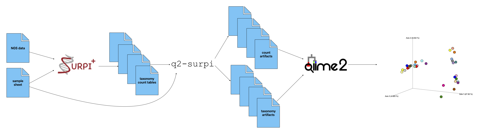

# q2-surpi

q2-surpi is a plugin that connects SURPI+ results to QIIME 2 for analysis. 
The below workflow shows that q2-surpi acts as a converter, extracting 
QIIME-formatted artifacts from SURPI+ outputs for use in downstream analyses.



## Installation

q2-surpi requires an existing QIIME 2 environment (see documentation at
https://docs.qiime2.org for QIIME 2 installation instructions).  To install 
the plugin, first activate the QIIME 2 environment and then install the 
plugin repository from github:

```
pip install git+https://github.com/AmandaBirmingham/q2-surpi.git
```

After this, it is necessary to refresh the QIIME 2 plugin cache:

```
qiime dev refresh-cache
```

The q2-surpi plugin should now be in the list of installed plugins produced
by running `qiime --help`

## Usage

In an active QIIME environment, import the SURPI+ count table of interest and 
the SURPI-compatible sample sheet into QIIME artifacts:
```
qiime tools import \
    --input-path surpi_output.counttable \
    --output-path surpi_output.qza \
    --type SurpiCountTable

qiime tools import \
    --input-path surpi_sample_sheet.txt \
    --output-path surpi_sample_info.qza \
    --type SurpiSampleSheet
```

With these artifacts, it is simple to extract a `FeatureTable[Frequency]` 
QIIME object containing the counts generated by SURPI, as well as a 
`FeatureData[Taxonomy]` QIIME object containing the associated taxonomies:

```
qiime surpi extract \
     --i-surpi-output surpi_output.qza \
     --i-surpi-sample-info surpi_sample_info.qza \
     --o-table surpi_counts.qza \
     --o-taxonomy surpi_taxonomy.qza
```

These objects are suitable for use in downstream QIIME functions such as 
`qiime diversity core-metrics-phylogenetic` or `qiime taxa barplot`.